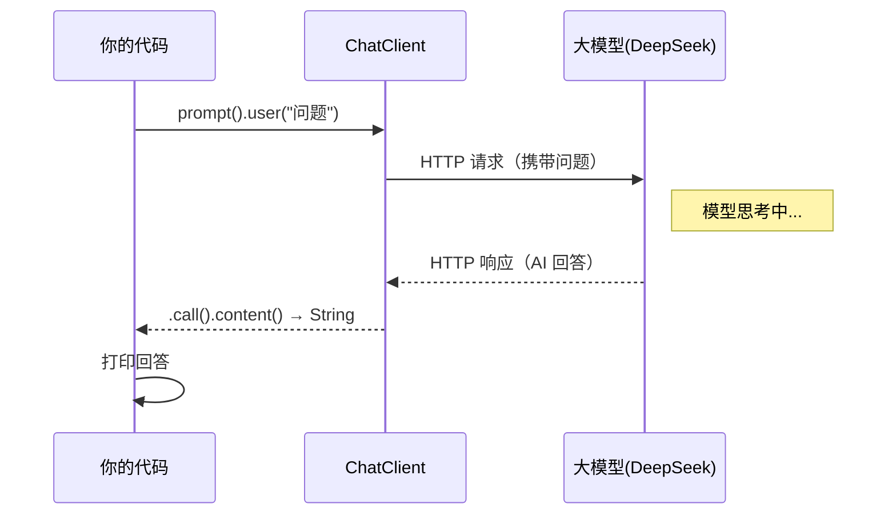

# 01 · 概念与快速上手

> 本模块目标：理解 Spring AI 最核心的几个概念，并跑通**人生第一个**大模型调用。

## 一、要懂的核心概念（零基础必读）

| 概念 | 大白话解释 |
|---|---|
| **大模型 (LLM)** | 像 DeepSeek、GPT 这样的 AI，给它文字、它回你文字。 |
| **ChatModel** | Spring AI 对"对话模型"的**底层抽象**，直接对接厂商 HTTP 接口。 |
| **ChatClient** | 建立在 ChatModel 之上的**高级客户端**，链式调用，最常用（本项目主角）。 |
| **Starter** | 一个依赖（`spring-ai-starter-model-openai`），引入后自动配置好一切。 |
| **自动配置** | Spring Boot 读取配置文件，自动帮你 new 好 `ChatClient.Builder`，拿来即用。 |

## 二、调用原理流程图



## 三、关键代码（一行链式调用）

```java
String answer = chatClient
        .prompt()           // 开始一次提问
        .user(question)     // 用户问题
        .call()             // 同步调用（阻塞等完整结果）
        .content();         // 取回答文本
```

## 四、怎么运行

1. 确保已在 `../config/spring-ai-common.yml` 配好 **DeepSeek 的 Key**（或设置环境变量 `DEEPSEEK_API_KEY`）。
2. 在**本模块目录**下执行：

```bash
cd 01-overview-quickstart
mvn spring-boot:run
```

3. 控制台应打印出 AI 对"什么是 Spring AI"的回答。

## 五、预期输出（示例）

```
========== 模块01：第一个 Spring AI 调用 ==========

【我问】请用一句话向 Java 初学者解释什么是 Spring AI？

【AI 答】Spring AI 是一个让 Java 开发者用熟悉的 Spring 方式轻松调用各种大模型的框架……

========== 演示结束：恭喜，你已成功调用大模型！ ==========
```

## 六、小结

- 引入一个 starter + 配一处 Key，就能用 `ChatClient` 调大模型。
- `prompt() → user() → call() → content()` 是最基础的调用四件套。
- 下一站：[02-chat-client](../02-chat-client) 学习更多 ChatClient 用法（流式输出、运行时参数）。
