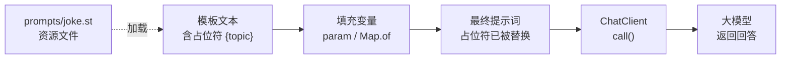

# 03 · Prompt 提示词模板

> 本模块目标：掌握"提示词(Prompt)"的多种构建方式——模板变量、System/User 角色、消息列表、从资源文件加载模板。

## 一、核心概念

| 概念 | 大白话解释 |
|---|---|
| **Prompt（提示词）** | 我们发给大模型的"话"。它由一条或多条带"角色"的消息组成。 |
| **Message（消息）** | 提示词的基本单元，带角色。常用 `SystemMessage`（人设/约束）、`UserMessage`（用户问题）。 |
| **占位符 `{变量}`** | 模板里的"空位"，运行时用实际值替换，让提示词可参数化、可复用。 |
| **PromptTemplate** | 提示词模板对象：`new PromptTemplate("...{x}...")`，再 `create(Map)` 填值生成 `Prompt`。 |
| **`.st` 资源文件** | 把提示词文本写进 classpath 文件，与 Java 代码解耦，方便维护。 |

## 二、本模块四个演示

1. **内联模板变量** —— `.user(u -> u.text("...{topic}...").param("topic","Spring Boot"))`，`system` 同理。
2. **底层 PromptTemplate** —— `new PromptTemplate("...{animal}...").create(Map.of(...))` 生成 `Prompt` 后调用。
3. **消息列表 + 角色** —— `new Prompt(List.of(new SystemMessage(...), new UserMessage(...)))`。
4. **从资源文件加载** —— `@Value("classpath:/prompts/joke.st") Resource` + `new PromptTemplate(resource)`。

## 三、模板变量如何变成最终提示词



## 四、关键代码

内联模板变量：

```java
chatClient.prompt()
        .system(s -> s.text("你是一位{role}").param("role", "严谨的技术导师"))
        .user(u -> u.text("请讲讲关于 {topic} 的 3 个要点").param("topic", "Spring Boot"))
        .call().content();
```

底层 PromptTemplate：

```java
PromptTemplate pt = new PromptTemplate("给我讲一个关于 {animal} 的{adjective}笑话");
Prompt p = pt.create(Map.of("animal", "猫", "adjective", "冷"));
String answer = chatClient.prompt(p).call().content();
```

消息列表 + 角色：

```java
Prompt prompt = new Prompt(List.of(
        new SystemMessage("你是一位精通中文的诗人，回答都要押韵。"),
        new UserMessage("用两句话描述春天的早晨。")));
String answer = chatClient.prompt(prompt).call().content();
```

从资源文件加载（`src/main/resources/prompts/joke.st`）：

```java
@Value("classpath:/prompts/joke.st")
private Resource jokeResource;

PromptTemplate pt = new PromptTemplate(jokeResource);
Prompt p = pt.create(Map.of("topic", "程序员", "style", "冷幽默"));
```

## 五、运行

```bash
cd 03-prompt
mvn spring-boot:run
```

依赖 DeepSeek 的 Key（已在 `../config/spring-ai-common.yml` 配置）。

## 六、小结

- 提示词 = 一串带角色的消息（System 设人设，User 提问题）。
- 用占位符 `{变量}` + `param`/`Map` 把提示词参数化，写一次到处复用。
- 提示词可以写进 `.st` 资源文件，与代码解耦，更易维护。
- 下一站：[04-structured-output](../04-structured-output) 学习把 AI 回答自动转成 Java 对象。
