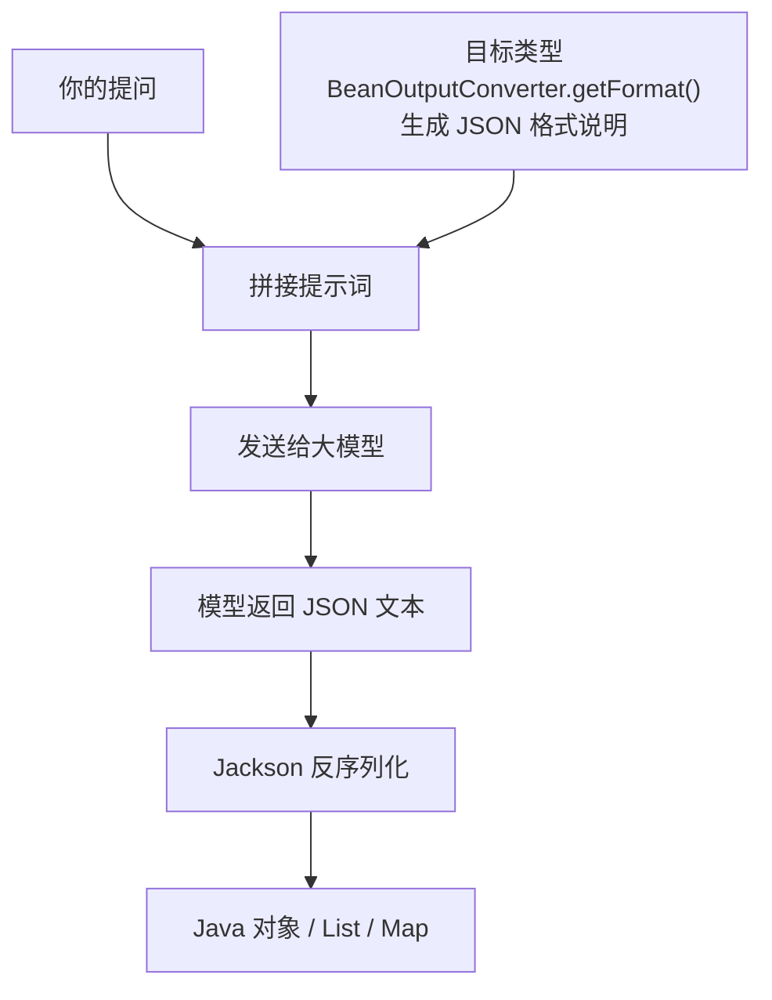

# 04 · 结构化输出

> 本模块目标：把大模型返回的"一段文字"自动转换成强类型的 Java 对象 / List / Map，让 AI 的输出能直接接入业务代码。

## 一、为什么需要结构化输出

大模型默认返回纯文本。但真实程序需要的是能 `set` 到字段、能存数据库、能参与计算的**结构化数据**。手动用正则/字符串解析既脆弱又啰嗦。Spring AI 提供了"结构化输出"机制：在调用链末尾把 `.content()` 换成 `.entity(目标类型)`，就能直接拿到 Java 对象。

| 写法 | 得到的类型 |
|---|---|
| `.entity(ActorFilms.class)` | 单个对象 `ActorFilms` |
| `.entity(new ParameterizedTypeReference<List<ActorFilms>>(){})` | `List<ActorFilms>` |
| `.entity(new ParameterizedTypeReference<Map<String,Object>>(){})` | `Map<String,Object>` |

> 泛型（List/Map）因 Java 的"类型擦除"不能用 `List.class`，必须用 `ParameterizedTypeReference` 这个"泛型类型令牌"（末尾的 `{}` 创建匿名子类来保留泛型信息）。

## 二、底层原理

`.entity(...)` 背后是 `BeanOutputConverter`，分两步工作：

1. **发请求前**：根据目标 Java 类型，用 `getFormat()` 生成一段"请按这个 JSON Schema 回答"的说明，悄悄追加到用户提示词后面。
2. **收响应后**：模型按要求返回 JSON 文本，转换器用 Jackson 把它反序列化成目标 Java 类型。



## 三、关键代码

```java
// 目标类型：record 必须是顶层或静态嵌套类型，Jackson 才能反序列化
public record ActorFilms(String actor, List<String> movies) {}

// 1) 转单个对象
ActorFilms af = chatClient.prompt()
        .user("列出周星驰的5部代表作")
        .call().entity(ActorFilms.class);

// 2) 转 List
List<ActorFilms> list = chatClient.prompt()
        .user("生成3位著名导演及其代表作")
        .call().entity(new ParameterizedTypeReference<List<ActorFilms>>() {});

// 3) 转 Map
Map<String, Object> map = chatClient.prompt()
        .user("...用 JSON 给出 title/year/actors 三个字段")
        .call().entity(new ParameterizedTypeReference<Map<String, Object>>() {});

// 4) 看底层：打印自动追加的"JSON 格式说明"
BeanOutputConverter<ActorFilms> converter = new BeanOutputConverter<>(ActorFilms.class);
System.out.println(converter.getFormat());
```

## 四、运行

```bash
cd 04-structured-output
mvn spring-boot:run
```

依赖 DeepSeek 的 Key（已在 `../config/spring-ai-common.yml` 配置）。

## 五、小结

- 用 `.entity(...)` 取代 `.content()`，一行代码把 AI 回答变成强类型 Java 数据。
- 泛型类型用 `ParameterizedTypeReference`；单一类型直接传 `Class`。
- 原理是 `BeanOutputConverter` 先注入 JSON 格式说明、再用 Jackson 反序列化。
- 下一站：[05-multimodality](../05-multimodality) 学习多模态（图片 + 文字一起输入）。
