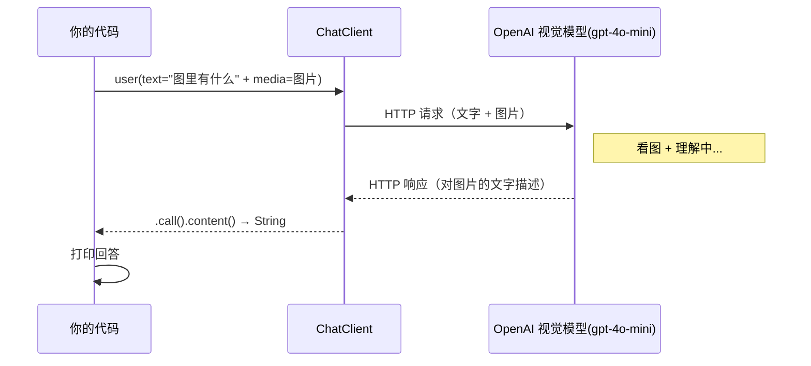

# 05 · 多模态（Multimodality）

> 本模块目标：理解"多模态"，学会把**图片 + 文字**一起发给大模型，让它"看图说话"。

## 一、什么是多模态

"模态"指信息的形式：文字、图片、音频、视频都是不同的模态。
**多模态（Multimodality）** 就是让模型同时接收多种模态的输入。本模块演示最常见的一种：
**图文混合**——给模型一张图片再配一句文字提问，模型结合二者理解并回答。

```
普通对话：   文字 ──► 模型 ──► 文字
多模态对话： 文字 + 图片 ──► 模型 ──► 文字（对图片的理解）
```

## 二、★ 为什么本模块要换成 OpenAI

本项目其它对话模块统一用 **DeepSeek**（便宜、国内可直连）。但是：

- **DeepSeek 目前不支持视觉**，看不懂图片，无法做多模态。
- 所以本模块必须改用**真正的 OpenAI 视觉模型**（`gpt-4o-mini`）。

做法：本模块自己的 `application.yml` 在导入共享配置之后，**用本地配置覆盖 chat 能力**，
把对话地址、Key、模型都指向 OpenAI：

```yaml
spring:
  ai:
    openai:
      chat:
        base-url: https://api.openai.com
        api-key: ${OPENAI_API_KEY:请填OpenAIKey}
        options:
          model: gpt-4o-mini
```

> 原理：`spring.config.import` 导入的共享文件优先级较低，模块自身 `application.yml` 里直接写的同名属性优先级更高，因此会**覆盖**共享配置里指向 DeepSeek 的 chat 设置。
> 运行前请设置环境变量 `export OPENAI_API_KEY=sk-你的OpenAIKey`。

## 三、调用流程图



## 四、关键代码

在 `user(...)` 的 lambda 里同时放文字和图片：

```java
String answer = chatClient.prompt()
        .user(u -> u
                .text("这张图片里有什么？请用中文描述")
                // 图片 URL 方式：media(MimeType, java.net.URL)
                .media(MimeTypeUtils.IMAGE_PNG,
                        URI.create("https://.../280px-PNG_transparency_demonstration_1.png").toURL()))
        .call()
        .content();
```

- `text(...)`：这条用户消息的文字部分（你的问题）。
- `media(...)`：给消息附加一张图片，第 1 个参数是图片 MIME 类型，第 2 个是图片来源。
- 这里用的是 `media(MimeType, URL)` 重载（用图片网址）。

> 提示：`Media` 类在 1.1.x 位于 `org.springframework.ai.content.Media`；本模块用 `user` lambda 的 `media(...)` 便捷方法，无需直接 new `Media`。

## 五、替代写法：读取本地图片（不联网）

1. 把任意一张 png 放到 `src/main/resources/images/sample.png`；
2. 把 `.media(...)` 换成（用 `media(MimeType, Resource)` 重载）：

```java
.media(MimeTypeUtils.IMAGE_PNG,
       new org.springframework.core.io.ClassPathResource("images/sample.png"))
```

## 六、运行

```bash
export OPENAI_API_KEY=sk-你的OpenAIKey
cd 05-multimodality
mvn spring-boot:run
```

控制台会打印模型对那张演示图片的中文描述。

## 七、小结

- 多模态 = 文字 + 图片（等）一起输入，模型综合理解。
- `user(u -> u.text(...).media(...))` 是发送图文消息的标准写法。
- 视觉能力依赖模型本身，DeepSeek 不支持，所以本模块改用 OpenAI 视觉模型。
- 下一站：[06-chat-memory](../06-chat-memory) 学习对话记忆，让 AI 记住上下文。
