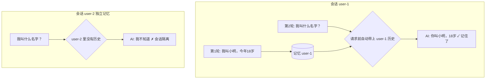

# 06 · 对话记忆（Chat Memory）

> 本模块目标：让 AI **记住上下文**，实现多轮连续对话，并理解"会话隔离"。

## 一、为什么需要"记忆"

大模型本身是**无状态**的：每次调用它都不记得上一次说了什么。
要实现"连续对话"（比如它能记住你叫小明），必须由**我们的程序**把历史消息存起来，
并在下一次请求时把这些历史**一起带上**发给模型。

Spring AI 把这件事封装好了：

| 角色 | 作用 |
|---|---|
| `ChatMemory` | 记忆仓库：负责存/取某个会话的历史消息 |
| `MessageWindowChatMemory` | 一种 ChatMemory 实现：滑动窗口，只保留最近 N 条 |
| `InMemoryChatMemoryRepository` | 默认的底层存储：把历史存在内存里 |
| `MessageChatMemoryAdvisor` | 顾问/拦截器：请求前自动塞入历史，回答后自动存回 |
| `ChatMemory.CONVERSATION_ID` | 会话 ID 的参数名：区分不同对话，实现隔离 |

## 二、流程图



## 三、关键代码

**1）创建记忆并挂到 ChatClient（构造器里）：**

```java
// 滑动窗口记忆，最多记住最近 10 条消息；默认用内存仓库 InMemoryChatMemoryRepository
ChatMemory chatMemory = MessageWindowChatMemory.builder()
        .maxMessages(10)
        .build();

this.chatClient = builder
        // 把记忆包成 Advisor 挂上去，之后每次调用自动存/取历史
        .defaultAdvisors(MessageChatMemoryAdvisor.builder(chatMemory).build())
        .build();
```

**2）调用时指定会话 ID（同一个 ID 共享记忆）：**

```java
chatClient.prompt()
        .user("我叫什么名字？今年多大？")
        .advisors(a -> a.param(ChatMemory.CONVERSATION_ID, "user-1"))
        .call()
        .content();
```

## 四、本模块演示

1. 会话 `user-1` 第一轮：`"我叫小明，今年18岁"`。
2. 会话 `user-1` 第二轮：`"我叫什么名字？今年多大？"` —— 能答出，证明**记住了**。
3. 会话 `user-2` 问同样的问题 —— 它**不知道**，证明不同会话**互相隔离**。

## 五、运行

```bash
cd 06-chat-memory
mvn spring-boot:run
```

用对话即可，沿用共享配置里的 DeepSeek（`../config/spring-ai-common.yml`），无需切换模型。

## 六、小结

- 模型本身无记忆，记忆由 `ChatMemory` 维护、由 `MessageChatMemoryAdvisor` 自动注入。
- 用 `CONVERSATION_ID` 区分会话：同 ID 共享上下文，不同 ID 互相隔离。
- 默认记忆存在内存里（重启即丢）；生产可换成基于数据库/Redis 的仓库。
- 下一站：[07-advisors](../07-advisors) 深入理解 Advisor 顾问/拦截器机制。
