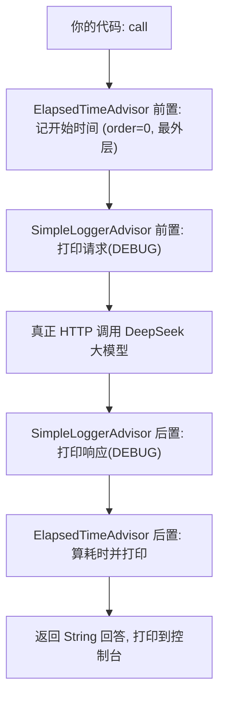

# 07 · Advisor（顾问 / 拦截器）

> 本模块目标：理解 Spring AI 的 **Advisor** 机制——它就像对话调用的"AOP 切面"，能在请求前后插入逻辑。Spring AI 的**对话记忆**与 **RAG** 底层都靠它实现。

## 一、Advisor 是什么

`Advisor`（顾问）是 Spring AI 提供的**拦截器/切面**扩展点。它能在一次对话调用中：

- **请求前**：改写/补充请求（如挂上历史记忆、检索到的文档、统一日志）。
- **响应后**：加工/记录响应（如打印日志、统计耗时、保存对话）。

多个 Advisor 串成一条**责任链（Chain）**，请求像水流一样依次穿过它们，最后才真正访问大模型；响应再原路返回。

| 概念 | 说明 |
|---|---|
| `Advisor` | 顶层接口，继承 `Ordered`，要求 `getName()` / `getOrder()` |
| `CallAdvisor` | 拦截**非流式** `call()`，实现 `adviseCall(request, chain)` |
| `StreamAdvisor` | 拦截**流式** `stream()`，实现 `adviseStream(...)` |
| `BaseAdvisor` | 同时覆盖 call+stream 的便捷接口，提供 `before()` / `after()` 两个钩子 |
| `CallAdvisorChain` | 责任链，`chain.nextCall(request)` 把请求交给下一环 |
| `order` | 顺序值，**越小越靠外层**（最先做前置、最后做后置） |

## 二、本模块两个演示

1. **内置 `SimpleLoggerAdvisor`**：自动打印每次请求/响应（DEBUG 级别）。本模块 `application.yml` 已把 `org.springframework.ai.chat.client.advisor` 调到 `DEBUG`，所以能看到明细。
2. **自定义 `ElapsedTimeAdvisor`**：实现 `CallAdvisor`，在 `chain.nextCall(...)` 前后计时，打印本次调用耗时。

## 三、责任链执行顺序（流程图）



> 像剥洋葱：`order` 最小的 Advisor 在最外层——它**最先**执行前置逻辑、**最后**执行后置逻辑，因此能量到包含其它 Advisor 在内的总耗时。

## 四、关键代码

注册 Advisor（构建 ChatClient 时）：

```java
this.chatClient = builder
        .defaultAdvisors(
                new SimpleLoggerAdvisor(),   // 内置日志 Advisor
                new ElapsedTimeAdvisor(0)    // 自定义计时 Advisor，order=0 最外层
        )
        .build();
```

自定义 Advisor 核心（实现 `CallAdvisor`）：

```java
public class ElapsedTimeAdvisor implements CallAdvisor {
    @Override
    public ChatClientResponse adviseCall(ChatClientRequest request, CallAdvisorChain chain) {
        long start = System.currentTimeMillis();          // 前置
        ChatClientResponse response = chain.nextCall(request); // 交给下一环 → 最终访问模型
        System.out.println("耗时 " + (System.currentTimeMillis() - start) + " ms"); // 后置
        return response;
    }
    @Override public String getName() { return "ElapsedTimeAdvisor"; }
    @Override public int getOrder() { return order; } // 越小越靠外层
}
```

> 也可以在**单次请求**上临时挂载：`prompt().advisors(new SimpleLoggerAdvisor()).user(...)`。

## 五、运行

```bash
cd 07-advisors
mvn spring-boot:run
```

依赖 DeepSeek 的 Key（已在 `../config/spring-ai-common.yml` 配置）。

## 六、小结

- Advisor 是对话调用的"切面"，分 `CallAdvisor`（非流式）/`StreamAdvisor`（流式）/`BaseAdvisor`（两者）。
- 多个 Advisor 组成责任链，`order` 越小越靠外层。
- 记住核心套路：`chain.nextCall(request)` 之前是前置、之后是后置。
- 下一站：[08-tool-calling](../08-tool-calling) 学习工具调用——让模型自动调用你的 Java 方法。
