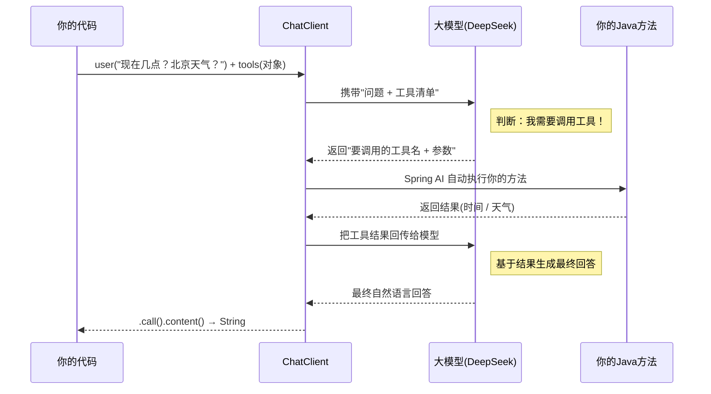

# 08 · Tool Calling（工具调用 / 函数调用）

> 本模块目标：让大模型在需要时**自动调用你写的 Java 方法**，获取实时/外部数据后再回答。这是构建智能体(Agent)的基础。

## 一、为什么需要工具调用

大模型是"训练时的快照"，它**不知道**：现在几点、今天天气、你数据库里的订单……
**工具调用**给模型装上"手脚"：当问题需要这些信息时，模型会主动请求调用你提供的方法，拿到结果再组织答案。

| 概念 | 说明 |
|---|---|
| `@Tool` | 标注在方法上，`description` 告诉模型"这个工具能干什么"（模型据此决定何时调用） |
| `@ToolParam` | 标注在参数上，`description` 告诉模型"这个参数是什么"（模型据此抽取参数值） |
| `.tools(对象)` | 把含 `@Tool` 方法的对象注册给本次调用 |

> 包路径（1.1.7，经 `javap` 查证）：
> `org.springframework.ai.tool.annotation.Tool`、`org.springframework.ai.tool.annotation.ToolParam`。
> `@Tool` 可用属性：`name` / `description` / `returnDirect` / `resultConverter`；
> `@ToolParam` 可用属性：`description` / `required`。

## 二、工具调用的完整回合（流程图）



> 关键：整个"判断 → 调用 → 回传 → 再回答"由 **Spring AI 自动编排**，可能来回多轮（本例同时查时间和天气）。你只需写好方法并 `.tools(...)` 注册。

## 三、关键代码

定义工具（普通 Java 类 + 注解）：

```java
public class DateTimeTools {
    @Tool(description = "获取当前的日期和时间")
    String getCurrentDateTime() {
        return java.time.LocalDateTime.now().toString();
    }

    @Tool(description = "获取指定城市的当前天气情况")
    String getWeather(@ToolParam(description = "要查询天气的城市名称，例如：北京") String city) {
        return city + "今天晴，25 摄氏度";
    }
}
```

注册并调用：

```java
String answer = chatClient.prompt()
        .user("现在几点了？北京天气怎么样？")
        .tools(new DateTimeTools())   // 注册工具，模型按需自动调用
        .call()
        .content();
```

## 四、运行

```bash
cd 08-tool-calling
mvn spring-boot:run
```

依赖 DeepSeek 的 Key（已在 `../config/spring-ai-common.yml` 配置）。运行后控制台带 `🔧` 的行表示对应工具方法确实被模型自动调用了。

## 五、小结

- 用 `@Tool` / `@ToolParam` 描述方法和参数，模型靠 `description` 决定何时调用、如何取参。
- `.tools(对象)` 注册工具，"判断→调用→回传→回答"全自动。
- `description` 写得越清楚，模型调用越准确。
- 下一站：[09-structured-output](../09-structured-output)（按项目实际模块顺序）继续学习结构化输出等进阶能力。
