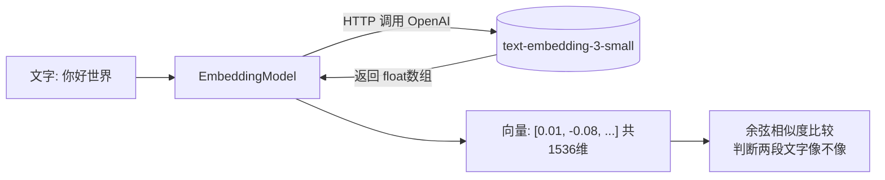

# 09 · 文本向量化 Embedding

> 本模块目标：理解什么是“把文字变成向量”，并学会用 `EmbeddingModel` 做单条/批量向量化和相似度计算。这是模块 10（向量库）、模块 11（RAG）的基础。

## 一、Embedding 是什么（零基础大白话）

把一段文字交给“向量化模型”，它会吐出一串数字（`float[]` 数组），叫做**向量**。

```
"猫"  ->  [0.012, -0.083, 0.250, ... ]   （text-embedding-3-small 输出 1536 个数字）
```

这串数字是文字“语义”的数学坐标。关键规律：**含义相近的文字，向量也相近**。
所以「猫」和「狗」的向量很接近，而「猫」和「汽车」的向量离得远。

| 名词 | 解释 |
|---|---|
| **向量 (vector)** | 一串浮点数 `float[]`，文字的语义坐标 |
| **维度 (dimension)** | 向量里有多少个数（本模型为 1536） |
| **余弦相似度** | 衡量两个向量方向的接近程度，范围 -1~1，越接近 1 越相似 |

## 二、本模块三个演示

1. **单条向量化** `embed("你好世界")` → 打印维度 + 前 8 个数值。
2. **批量向量化** `embedForResponse(List.of("猫","狗","汽车"))` → 一次转多条。
3. **余弦相似度** 自写公式比较「猫 vs 狗」「猫 vs 汽车」，验证语义相近的分更高。

## 三、流程图



## 四、关键代码

```java
// 1) 单条：文字 -> 向量
float[] v = embeddingModel.embed("你好世界");
System.out.println("维度 = " + v.length);     // 1536

// 2) 批量：一次转多条
EmbeddingResponse resp = embeddingModel.embedForResponse(List.of("猫","狗","汽车"));
List<Embedding> results = resp.getResults();   // 每个 Embedding.getOutput() 是 float[]

// 3) 余弦相似度：cos = (A·B) / (|A|*|B|)
double sim = cosineSimilarity(embeddingModel.embed("猫"), embeddingModel.embed("狗"));
```

## 五、怎么运行

```bash
export OPENAI_API_KEY=sk-你的OpenAI密钥   # embedding 走真正的 OpenAI
cd 09-embedding
mvn spring-boot:run
```

> 注意：本模块的向量化走的是**真正的 OpenAI**（共享配置里 embedding 段指向 `api.openai.com`，模型 `text-embedding-3-small`），因此必须配置 `OPENAI_API_KEY`，仅有 DeepSeek 的 Key 不够。

## 六、预期输出（示例）

```
===== 演示3：余弦相似度对比 =====
「猫」 vs 「狗」  相似度 = 0.62
「猫」 vs 「汽车」相似度 = 0.31
结论：猫和狗都是动物，语义更接近，相似度更高。
```

## 七、小结

- Embedding = 把文字转成“语义向量”（`float[]`），相近含义的向量也相近。
- 用余弦相似度即可量化两段文字“像不像”。
- 下一站：[10-vector-store](../10-vector-store) —— 把一堆文档的向量存进“向量数据库”，做语义检索。
