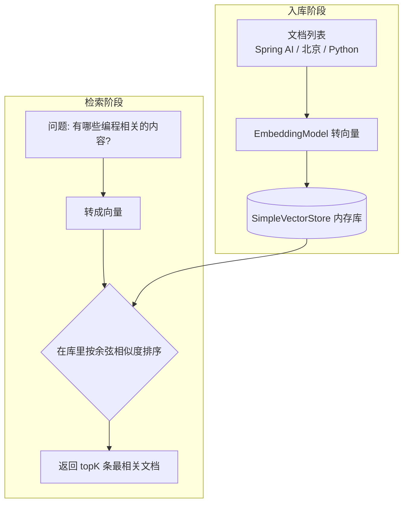

# 10 · 向量数据库 VectorStore

> 本模块目标：理解“向量数据库”和“语义检索”，用内存版 `SimpleVectorStore` 存文档、按语义找相关内容。它是 RAG（模块 11）的检索环节。

## 一、向量数据库是什么（大白话）

模块 09 学会了把一段文字变成**向量**（一串数字）。向量数据库就是：

1. **入库**：把一批文档逐条转成向量存起来；
2. **检索**：给一个问题，也转成向量，然后在库里找“离它最近”的几条文档返回。

和传统数据库的区别：

| | 传统数据库 | 向量数据库 |
|---|---|---|
| 查询方式 | 关键字精确匹配 (`like '%编程%'`) | 语义相似度（意思相近就能命中） |
| 例子 | 必须含“编程”二字才查得到 | 问“编程相关”能命中“Java 框架”“Python” |

> 本模块用 Spring AI 内置的 **`SimpleVectorStore`（内存版）**：数据存在内存 Map 里，无需安装任何数据库，最适合学习。换成 PgVector / Redis / Milvus 时，`add` / `similaritySearch` 用法完全一样。

## 二、流程图



## 三、关键代码

```java
// 1) 创建内存向量库（需要 EmbeddingModel 来做向量化）
SimpleVectorStore vectorStore = SimpleVectorStore.builder(embeddingModel).build();

// 2) 添加文档：入库时自动把每条文本转成向量
vectorStore.add(List.of(
        new Document("Spring AI 是 Java 的 AI 框架"),
        new Document("北京是中国的首都"),
        new Document("Python 是一门编程语言")));

// 3) 语义检索：返回最相关的 topK 条
List<Document> results = vectorStore.similaritySearch(
        SearchRequest.builder().query("有哪些编程相关的内容？").topK(2).build());
```

## 四、怎么运行

```bash
export OPENAI_API_KEY=sk-你的OpenAI密钥   # 入库/检索都要把文字转向量，走真正的 OpenAI
cd 10-vector-store
mvn spring-boot:run
```

## 五、预期输出（示例）

```
===== 演示2：语义检索 =====
提问：有哪些编程相关的内容？
命中文档（按相似度排序）：
  - Spring AI 是 Java 的 AI 框架 （相似度=0.55）
  - Python 是一门编程语言 （相似度=0.52）
```

问题里没有出现“Java/Python”，但语义相关的两条被命中，“北京是首都”被排除——这就是语义检索。

## 六、小结

- 向量库 = 存文档向量 + 按语义相似度检索，是“关键字搜索”的升级。
- `SimpleVectorStore` 是零依赖的内存实现，API 与生产级向量库一致。
- 下一站：[11-rag-etl](../11-rag-etl) —— 把“语义检索”接到大模型上，做 RAG（先检索资料再回答），并演示文档 ETL 切分管道。
