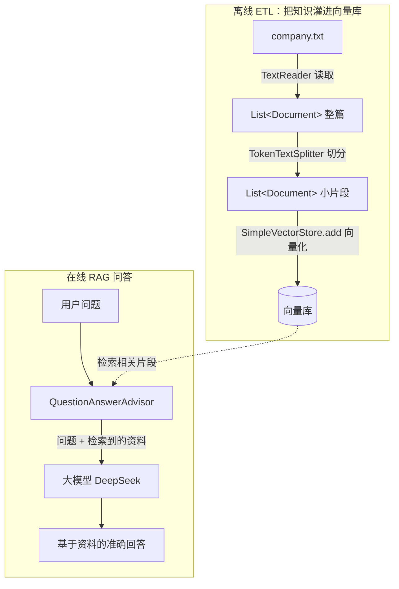

# 11 · 检索增强生成 RAG + 文档 ETL 管道

> 本模块目标：把模块 09（向量化）和模块 10（向量库）串起来，接到大模型上，做出能回答“私有知识”的 RAG 系统；同时演示文档 ETL 处理管道。

## 一、为什么需要 RAG（大白话）

大模型只会它训练时见过的公开知识。你问它“**我们公司**每周几远程办公？”，它根本不认识你这家公司，只会回答“不知道”或者**瞎编**（幻觉）。

**RAG（检索增强生成）** 的思路很朴素：

1. 先把你自己的资料（公司规章、产品文档…）存进向量库；
2. 提问时，先**检索**出最相关的几段资料；
3. 把这些资料塞进提示词，让模型**看着资料回答**。

这样模型就能准确回答私有知识，而且不容易胡编。

## 二、两条主线

### 主线 A：ETL 文档管道（把知识灌进向量库）

| 阶段 | 做什么 | 用到的类 |
|---|---|---|
| **Extract 读取** | 把 `company.txt` 读成文档 | `TextReader` |
| **Transform 切分** | 把长文切成小片段，便于精确检索 | `TokenTextSplitter` |
| **Load 入库** | 把片段向量化后存进库 | `SimpleVectorStore` |

### 主线 B：RAG 问答（检索 + 生成）

给 `ChatClient` 挂上 `QuestionAnswerAdvisor`，它会在请求发给模型前，自动检索相关片段并拼进提示词。

## 三、流程图



## 四、关键代码

```java
// ===== ETL：读取 -> 切分 -> 入库 =====
TextReader reader = new TextReader(new ClassPathResource("docs/company.txt"));
List<Document> raw = reader.get();                       // 读取
List<Document> chunks = new TokenTextSplitter().apply(raw); // 切分
vectorStore.add(chunks);                                 // 向量化入库

// ===== RAG 问答：挂上检索顾问 =====
String answer = chatClient.prompt()
        .advisors(QuestionAnswerAdvisor.builder(vectorStore).build()) // 自动检索+拼进提示词
        .user("我们公司每周几远程办公？年假多少天？")
        .call()
        .content();
```

> 依赖说明：`QuestionAnswerAdvisor` 位于 `spring-ai-advisors-vector-store`（包名 `org.springframework.ai.chat.client.advisor.vectorstore`），不在 OpenAI starter 的传递依赖里，故本模块 pom 显式引入；它又会传递带来 `spring-ai-vector-store`（含 `SimpleVectorStore`）。

## 五、怎么运行（需要两个 Key）

```bash
export DEEPSEEK_API_KEY=sk-你的DeepSeek密钥   # 对话(chat)走 DeepSeek
export OPENAI_API_KEY=sk-你的OpenAI密钥       # 向量化(embedding)走 OpenAI
cd 11-rag-etl
mvn spring-boot:run
```

## 六、预期输出（示例）

```
===== 演示2：不用 RAG 直接问 =====
AI（无知识库）：抱歉，我没有关于“你们公司”的具体信息……

===== 演示3：使用 RAG 问答 =====
AI（带知识库）：根据公司手册，星辰科技每周三是远程办公日，正式员工每年享有 20 天年假。
```

同一个问题，挂上 RAG 后才答得出——因为这些是只有 `company.txt` 才知道的虚构信息。

## 七、小结

- RAG = 先检索私有资料，再让模型看着资料回答，解决“模型不知道 / 瞎编”问题。
- ETL 管道（读取 → 切分 → 入库）是把任意文档变成可检索知识库的标准流程。
- `QuestionAnswerAdvisor` 把“检索”这步自动化，挂到 `ChatClient` 上即可。
- 这是 RAG 知识库三件套（09 向量化 → 10 向量库 → 11 RAG）的收官。下一站：[12-image-model](../12-image-model) 学习文生图。
