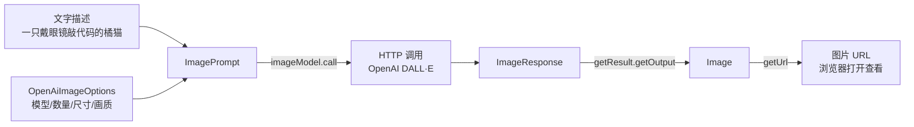

# 12 · 文生图（Image Model）

> 本模块目标：学会用一段文字描述，让 AI 生成一张图片（OpenAI DALL·E）。

## 一、知识点：什么是"文生图"

文生图（Text-to-Image）就是**给 AI 一句话，它帮你画一张图**。背后是专门的图片生成模型（如 OpenAI 的 DALL·E）。Spring AI 把这类能力抽象成一套统一接口：

| 抽象 | 作用 |
|---|---|
| `ImageModel` | 图片模型统一接口，核心方法 `call(ImagePrompt)` → `ImageResponse` |
| `ImagePrompt` | 一次请求 = 文字描述 + 可选生成参数 |
| `OpenAiImageOptions` | OpenAI 专属参数（模型、数量、尺寸、画质） |
| `ImageResponse` | 返回结果，内部装着 `ImageGeneration` |
| `Image` | 单张图片，`getUrl()` 取链接、`getB64Json()` 取 Base64 内容 |

> 重要：文生图是 OpenAI 真正的能力，**DeepSeek 不支持**。本模块必须使用真实的 OpenAI Key。

## 二、流程图



## 三、关键代码

```java
// 1) 生成参数（方法名以 1.1.7 真实签名为准：N/width/height 链式风格）
OpenAiImageOptions options = OpenAiImageOptions.builder()
        .model("dall-e-3")    // 文生图模型
        .N(1)                 // 生成 1 张（dall-e-3 只支持 1 张）
        .width(1024)          // 宽
        .height(1024)         // 高
        .quality("standard")  // 画质 standard / hd
        .build();

// 2) 描述 + 参数 → 请求
ImagePrompt prompt = new ImagePrompt("一只戴眼镜在敲代码的橘猫，卡通风格", options);

// 3) 调用并取出图片 URL
ImageResponse resp = imageModel.call(prompt);
String url = resp.getResult().getOutput().getUrl();
System.out.println(url); // 复制到浏览器即可查看
```

## 四、运行

本模块需要**真实的 OpenAI Key**（DeepSeek 不支持文生图）：

```bash
export OPENAI_API_KEY=sk-你的OpenAI密钥
cd 12-image-model
mvn spring-boot:run
```

控制台会打印一条图片 URL，**复制到浏览器地址栏**即可查看 AI 生成的图片。该 URL 是 OpenAI 的临时链接，过段时间会失效，请及时打开或下载。

## 五、小结

- 文生图用的是 `ImageModel` 这一套抽象，调用四件套：`OpenAiImageOptions` → `ImagePrompt` → `call()` → `getResult().getOutput().getUrl()`。
- OpenAI 默认返回图片 URL；也可设 `responseFormat("b64_json")` 直接拿 Base64 内容（`getB64Json()`）。
- 下一站：[13-audio-model](../13-audio-model) 学习语音能力（文字转语音 + 语音转文字）。
