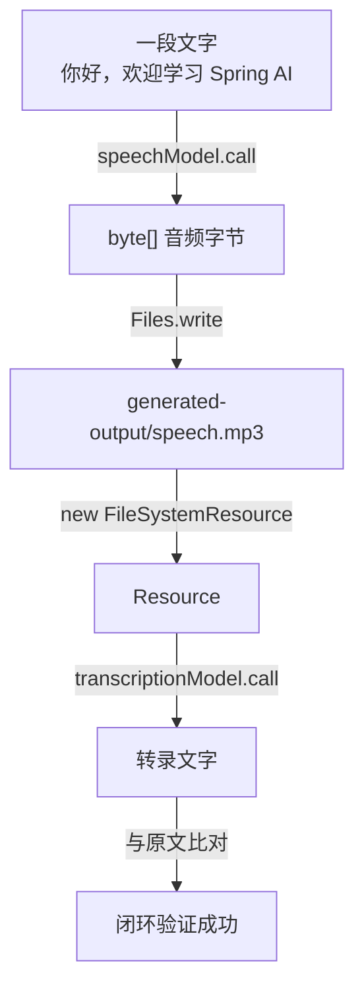

# 13 · 语音能力（Audio Model）

> 本模块目标：掌握两项语音能力——文字转语音(TTS) 与 语音转文字(转录)，并把它们串成一个自洽闭环。

## 一、知识点：两项语音能力

| 能力 | 英文 | 模型抽象 | 核心方法 |
|---|---|---|---|
| 文字转语音 | TTS (Text-To-Speech) | `OpenAiAudioSpeechModel` | `byte[] call(String text)` |
| 语音转文字 | 转录 (Transcription / Whisper) | `OpenAiAudioTranscriptionModel` | `String call(Resource audio)` |

引入 `spring-ai-starter-model-openai` 后，这两个 Bean 会被**自动配置**好，直接注入即可使用。

> 重要：语音能力是 OpenAI 真正的能力，**DeepSeek 不支持**。本模块必须使用真实的 OpenAI Key。
> 生成的音频写在 `generated-output/`（已被父项目 `.gitignore` 忽略）。

## 二、闭环流程图

把"文字 → 语音 → 文字"串起来，最直观地验证两项能力：



## 三、关键代码

```java
// 第一步：文字转语音(TTS)，返回 mp3 字节，用 java.nio 写文件
byte[] audioBytes = speechModel.call("你好，欢迎学习 Spring AI 的语音能力。");
Path dir = Paths.get("generated-output");
Files.createDirectories(dir);                 // 目录不存在则创建
Files.write(dir.resolve("speech.mp3"), audioBytes);

// 第二步：语音转文字(转录)，把 mp3 包装成 Resource 交给转录模型
FileSystemResource audio = new FileSystemResource("generated-output/speech.mp3");
String text = transcriptionModel.call(audio); // 直接返回转录文本
System.out.println(text);
```

## 四、运行

本模块需要**真实的 OpenAI Key**（DeepSeek 不支持语音）：

```bash
export OPENAI_API_KEY=sk-你的OpenAI密钥
cd 13-audio-model
mvn spring-boot:run
```

运行后：
1. 会在 `generated-output/speech.mp3` 生成一段语音（可用播放器打开听）。
2. 控制台打印把它转录回来的文字，与原始文字基本一致即闭环成功。

## 五、小结

- 语音有两类模型：`OpenAiAudioSpeechModel`（TTS）与 `OpenAiAudioTranscriptionModel`（转录）。
- 最小用法：`speechModel.call(text)` 拿 `byte[]`；`transcriptionModel.call(resource)` 拿 `String`。
- 两者都有更完整的 `call(...Prompt)` 重载，可传更多参数（音色、语速、语言等），入门用简化版即可。
- 下一站：[14-mcp](../14-mcp) 学习模型上下文协议 MCP。
