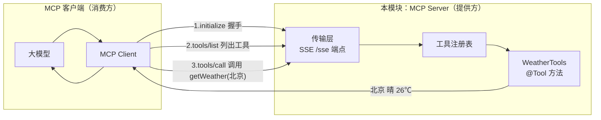

# 14 · 模型上下文协议 MCP（Model Context Protocol）

> 本模块目标：理解 MCP 的 Client/Server 架构，并用 Spring AI 构建一个**最小可用的 MCP Server**，对外暴露 `getWeather`、`getCurrentTime` 两个工具。

## 一、MCP 是什么（大白话）

过去每个 AI 应用要接入“外部工具/数据”，都得各写各的对接代码，互不兼容。**MCP** 是 Anthropic 提出的一套**开放标准协议**，相当于给“AI 应用”和“外部工具”之间定义了统一的“插头规格”：

| 角色 | 说明 | 本模块 |
|---|---|---|
| **MCP Server**（提供方） | 按 MCP 规范把一批**工具/资源/提示词**暴露出去 | ★ 我们做的就是它 |
| **MCP Client**（消费方） | 连接 Server，列出可用工具，在大模型需要时调用 | 如 Claude Desktop / 另一个 Spring AI 应用 |
| **工具 Tool** | 一个可被调用的函数（名字 + 描述 + 入参 schema） | `getWeather`、`getCurrentTime` |

一句话：**MCP 让“谁提供工具”和“谁使用工具”彻底解耦**，只要双方都说 MCP，就能即插即用。

## 二、整体架构与调用流程



调用四步：**握手 → 列出工具 → 调用工具 → 返回结果**，全部走 MCP 标准消息。

## 三、两种传输方式：STDIO vs SSE

| 传输 | 原理 | 适用场景 | 本模块 |
|---|---|---|---|
| **STDIO** | Server 作为子进程，通过标准输入/输出（stdin/stdout）收发 MCP 消息 | 本地、单机、由客户端拉起的进程（如 Claude Desktop 启动一个本地命令） | ✗ |
| **SSE / HTTP** | Server 是个 Web 服务，客户端通过 HTTP + Server-Sent Events 连接 `/sse` | 远程/网络访问、可被多个客户端连接 | ★ 用这个（`spring-ai-starter-mcp-server-webmvc`） |

## 四、关键代码

**1) 用 `@Tool` 声明工具**（`WeatherTools.java`）：
```java
@Tool(description = "查询指定城市的当前天气情况……")
public String getWeather(@ToolParam(required = true, description = "城市名称") String city) {
    return city + "：晴，气温 26℃……";
}
```

**2) 注册成 MCP 工具**（`McpServerConfig.java`）：
```java
@Bean
public ToolCallbackProvider weatherToolCallbackProvider(WeatherTools weatherTools) {
    return MethodToolCallbackProvider.builder()
            .toolObjects(weatherTools)   // 反射扫描 @Tool 方法
            .build();                    // MCP Server Starter 会自动把它暴露为 MCP 工具
}
```

**3) 在 `application.yml` 配置服务器**：
```yaml
spring:
  ai:
    mcp:
      server:
        name: demo-weather-server
        version: 1.0.0
        type: SYNC
        sse-endpoint: /sse
```

## 五、怎么连接本 Server（概念演示，不要求实跑）

启动后，本 Server 在 `http://localhost:8090/sse` 提供 SSE 端点。

- **方式 A：另一个 Spring AI 应用作为 MCP Client**
  引入 `spring-ai-starter-mcp-client-webflux`，配置远端 SSE 地址：
  ```yaml
  spring:
    ai:
      mcp:
        client:
          sse:
            connections:
              weather:
                url: http://localhost:8090
  ```
  之后该客户端的 `ChatClient` 就能自动发现并调用本 Server 的 `getWeather` 等工具。

- **方式 B：Claude Desktop 作为 MCP Client**
  在 Claude Desktop 的 MCP 配置中添加一个指向本 Server 的连接（SSE 传输需要桥接，或改用 STDIO 变体）。连接后，Claude 在对话中即可使用这些工具。

## 六、运行方式

```bash
cd 14-mcp
mvn spring-boot:run
```
> 这是一个 **Web 服务器** 应用，启动后会常驻不退出（正常现象），按 `Ctrl+C` 停止。本模块重在编译通过与概念理解，不要求实际联调。

## 七、小结

- MCP = AI 应用接入外部工具的**统一标准协议**，分 Server（提供）/ Client（消费）。
- Spring AI 里：`@Tool` 写工具 → `MethodToolCallbackProvider` 包装 → MCP Server Starter 自动暴露。
- 传输二选一：**STDIO**（本地子进程）/ **SSE+HTTP**（网络，本模块）。
- 下一站：[15-model-evaluation](../15-model-evaluation) 学习用“LLM 当裁判”自动评估回答质量。
