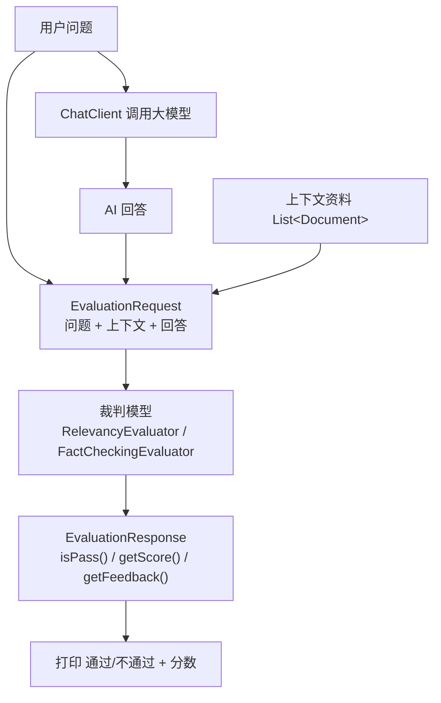

# 15 · 模型评估（Model Evaluation）

> 本模块目标：学会用“**LLM 当裁判**（LLM-as-a-judge）”自动评估 AI 回答的质量——**相关性（Relevancy）** 和 **事实性（FactChecking）**。

## 一、为什么需要模型评估

AI 的回答是**自由文本**，没有唯一标准答案，很难用传统的 `assertEquals` 判对错。于是我们引入“**另一个大模型当裁判**”：把【用户问题 + 上下文资料 + 待评回答】交给裁判模型，让它按规则判定 **通过/不通过** 并给出分数。

常见用途：

| 场景 | 说明 |
|---|---|
| **回归测试** | 改了提示词/换了模型后，批量跑评估，防止回答质量悄悄变差。 |
| **质量监控** | 对线上回答抽样打分，及时发现“跑题”或“胡编（幻觉）”。 |

## 二、两类评估器

| 评估器 | 评什么 | 输入 |
|---|---|---|
| `RelevancyEvaluator` | **相关性**：回答是否切合用户问题（结合上下文） | 问题 + 上下文 + 回答 |
| `FactCheckingEvaluator` | **事实性**：回答是否被给定上下文/资料支持（有无幻觉） | 上下文事实 + 待核查陈述 |

二者都实现了统一接口 `org.springframework.ai.evaluation.Evaluator`，返回统一的 `EvaluationResponse`（`isPass()` / `getScore()` / `getFeedback()`）。

## 三、流程图



## 四、关键代码

**构造评估器**（裁判内部也要调大模型，所以需要 `ChatClient.Builder`）：
```java
RelevancyEvaluator relevancy = RelevancyEvaluator.builder()
        .chatClientBuilder(builder)
        .build();

FactCheckingEvaluator factCheck = FactCheckingEvaluator.builder(builder).build();
```

**相关性评估**：
```java
String answer = chatClient.prompt().user(question).call().content();
List<Document> context = List.of(new Document("……相关说明……"));
EvaluationRequest req = new EvaluationRequest(question, context, answer); // 问题 + 上下文 + 回答
EvaluationResponse resp = relevancy.evaluate(req);
System.out.println(resp.isPass() + " / " + resp.getScore());
```

**事实性评估**（`dataList` = 事实上下文，`responseContent` = 待核查陈述）：
```java
EvaluationRequest req = new EvaluationRequest(facts, claim);
EvaluationResponse resp = factCheck.evaluate(req);
```

## 五、`EvaluationRequest` 的几个构造形态

| 构造器 | 含义 |
|---|---|
| `new EvaluationRequest(userText, responseContent)` | 仅“问题 + 回答” |
| `new EvaluationRequest(dataList, responseContent)` | “上下文 + 回答”（事实核查常用） |
| `new EvaluationRequest(userText, dataList, responseContent)` | “问题 + 上下文 + 回答”（相关性常用） |

## 六、运行方式

```bash
cd 15-model-evaluation
mvn spring-boot:run
```
依赖 DeepSeek 的 Key（已在 `../config/spring-ai-common.yml` 配置）。裁判模型这里直接复用 DeepSeek。

## 七、小结

- 评估的核心思想：**让另一个 LLM 当裁判**，把“主观质量”转成“可自动化的判定”。
- `RelevancyEvaluator` 看切题、`FactCheckingEvaluator` 看是否符合事实。
- 结果三件套：`isPass()` / `getScore()` / `getFeedback()`。
- 下一站：[16-observability-testing](../16-observability-testing) 学习可观测性与如何给 AI 应用写测试。
