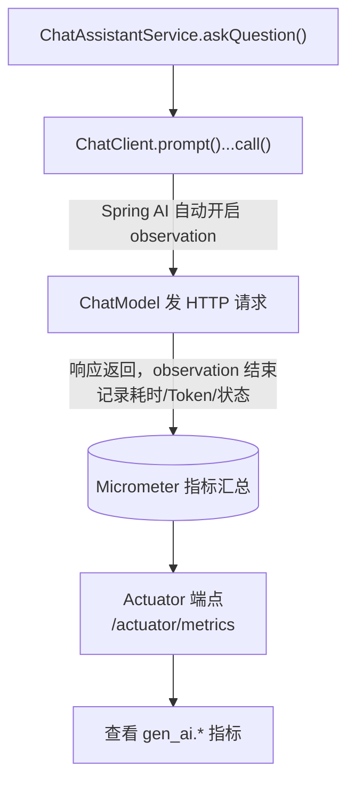
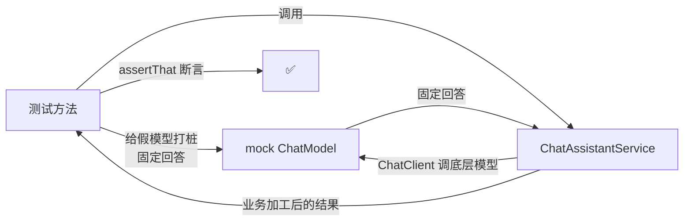

# 16 · 可观测性与测试（Observability & Testing）

> 本模块目标：① 学会**观测** AI 调用（指标、耗时、Token）；② 学会在**不调真实大模型**的前提下给 AI 应用写测试。

## 一、可观测性是什么

把应用运行时的内部状态（指标 metrics、链路 trace、日志 log）暴露出来，方便监控与排障。Spring AI 会**自动**为每次 `ChatClient`/`ChatModel` 调用产生 **Micrometer observation（观测点）**，记录耗时、模型名、Token 用量、是否异常等——我们**无需手写埋点**。再配合 **Actuator** 把指标通过 HTTP 端点暴露出来即可查看。

### observation 如何贯穿调用链



### 配置与查看

`application.yml` 暴露端点：
```yaml
management:
  endpoints:
    web:
      exposure:
        include: health,metrics,info
```

启动后访问：

| 端点 | 作用 |
|---|---|
| `GET /actuator/metrics` | 指标列表（含 Spring AI 的 `gen_ai.*` 指标） |
| `GET /actuator/metrics/{name}` | 某个指标的详情（耗时、Token 用量等） |
| `GET /actuator/health` | 健康检查 |

## 二、如何测试 AI 应用（不花钱、不联网、可重复）

真实调用大模型**花钱、慢、回答还不固定**，不适合写进测试。做法是：**把底层 `ChatModel` 换成“假模型（mock）”**，让它返回**写死的固定回答**，然后只验证**我们自己的业务逻辑**是否正确。



### 关键写法（Spring Boot 3.5 推荐 `@MockitoBean`）

> 旧的 `@MockBean` 在 Spring Boot 3.4+ 已**废弃**，3.5 推荐用 `org.springframework.test.context.bean.override.mockito.MockitoBean`。

```java
@SpringBootTest
@ActiveProfiles("test")          // 让标了 @Profile("!test") 的 Runner 不在测试期运行
class ChatAssistantServiceTest {

    @MockitoBean ChatModel chatModel;          // 用假模型替换真实 ChatModel
    @Autowired  ChatAssistantService service;  // 被测的真实业务 Service

    @Test
    void test() {
        // 打桩：任何 Prompt 进来都返回固定回答
        ChatResponse fake = new ChatResponse(List.of(
                new Generation(new AssistantMessage("  你好，我是助手  "))));
        given(chatModel.call(any(Prompt.class))).willReturn(fake);

        String result = service.askQuestion("随便问一句");

        assertThat(result).isEqualTo("AI 助手：你好，我是助手"); // 验证业务加工逻辑
    }
}
```

要点：
- `@MockitoBean ChatModel` 替换容器里的 `ChatModel`，自动配置的 `ChatClient.Builder` 便基于假模型构建，**调用不走网络**。
- 断言的是 **Service 的业务加工逻辑**（加前缀、trim、空结果兜底），而非大模型本身。

## 三、运行方式

应用（含真实调用，需要 Key）：
```bash
cd 16-observability-testing
mvn spring-boot:run
# 另开终端：curl http://localhost:8080/actuator/metrics
```

只跑测试（**不需要 Key、不联网**）：
```bash
cd 16-observability-testing
mvn test
```

## 四、小结

- Spring AI 自动为 AI 调用产生 observation；Actuator 把指标通过 `/actuator/metrics` 暴露。
- 测试 AI 应用用 `@MockitoBean` 模拟 `ChatModel` 返回固定回答，专注验证**自己的业务逻辑**。
- 这是本系列最后一站 —— 回到 [项目首页](../README.md) 复习全部 16 个模块。
