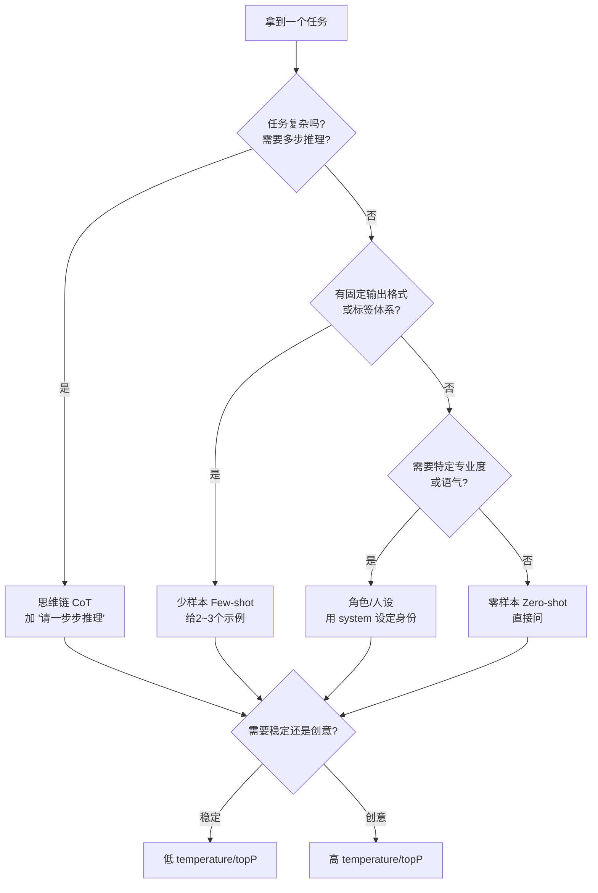

# 17 · 提示工程模式（Prompt Engineering Patterns）

> 本模块目标：掌握"如何把提示词写好"的系统化方法。同一个问题，换种问法，模型表现可能天差地别。
> 参考 Spring AI 官方 Guides 的 **Prompt Engineering Patterns**。

## 一、什么是提示工程

提示工程（Prompt Engineering）就是**有方法地设计提示词**，让大模型给出更准确、更稳定、更符合预期的回答。它有几个可调"旋钮"：要不要给例子、要不要设角色、要不要让它推理、采样参数怎么调。

## 二、本模块演示的 5 种核心模式

| 模式 | 做法 | 适用场景 |
|---|---|---|
| 零样本 Zero-shot | 直接提问，不给例子 | 常见、直白的任务（常识问答、简单翻译），最省事 |
| 少样本 Few-shot | 提示里给几个"输入→输出"示例 | 需要固定输出格式/标签体系，或任务小众、零样本不稳定 |
| 角色/人设 Role/Persona | 用 `system` 设定专家身份/语气/受众 | 需要专业度、固定语气或面向特定读者 |
| 思维链 CoT | 要求"一步步推理"再给答案 | 数学、逻辑、多步推理等复杂任务 |
| 参数控制 | 调 `temperature` / `topP` | 低温=稳定可复现；高温=创意发散 |

## 三、模式选择流程图



## 四、关键代码片段

少样本（在一段提示里给示例 + 新问题）：

```java
String prompt = """
        请像下面的示例一样，只输出情感标签（正面/负面/中性），不要解释：
        句子：今天阳光明媚，心情真好。 => 正面
        句子：快递又丢件了，气死我了。 => 负面
        句子：会议定在下午三点。       => 中性
        句子：这部电影剧情拖沓，看睡着了。 =>""";
chatClient.prompt().user(prompt).call().content();
```

思维链（关键就是"请一步步推理"）：

```java
chatClient.prompt()
    .user(question + " 请一步步思考、写出计算过程，最后再给出最终答案。")
    .call().content();
```

参数控制（用 `OpenAiChatOptions` 调温度）：

```java
OpenAiChatOptions creative = OpenAiChatOptions.builder()
        .temperature(1.5)   // 高温更发散
        .topP(1.0)
        .build();
chatClient.prompt().user(task).options(creative).call().content();
```

## 五、运行

```bash
cd 17-prompt-engineering
mvn spring-boot:run
```

依赖 DeepSeek 的 Key（已在 `../config/spring-ai-common.yml` 配置）。

## 六、小结

- 提示词是**可以工程化设计**的，不是随便写。
- 记住 5 个旋钮：给不给例子、设不设角色、要不要推理、调什么参数。
- 下一站：[18-agents](../18-agents) 学习用代码编排多次 LLM 调用，构建高效智能体。
