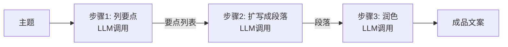
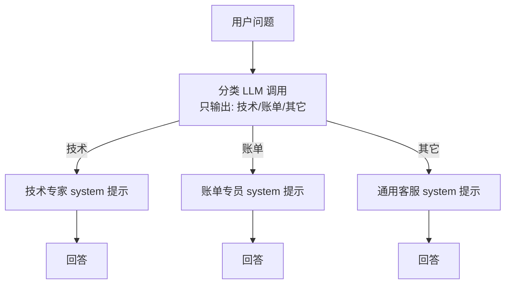
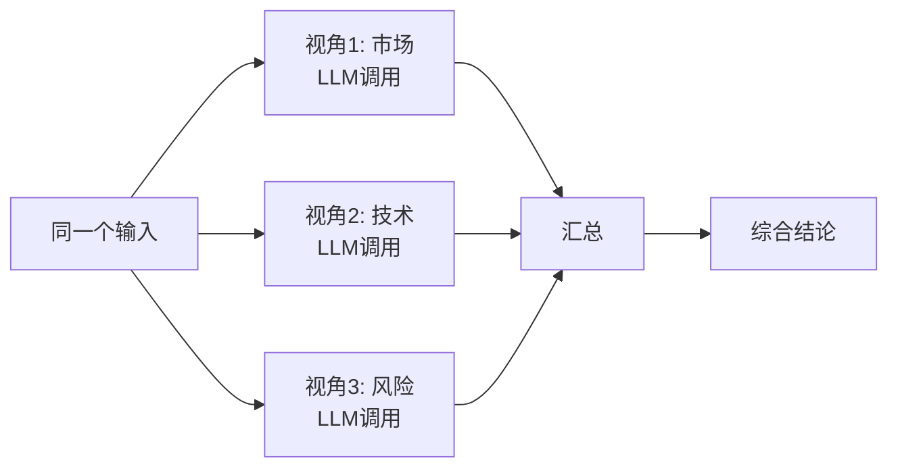
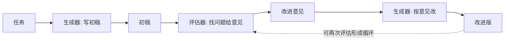

# 18 · 构建高效智能体（Building Effective Agents）

> 本模块目标：理解"智能体 = 用代码编排多次 LLM 调用"，而不是单次问答。
> 用纯 Java + `ChatClient` 手写编排，**不依赖任何额外 Agent 框架**。
> 参考 Spring AI 官方 Guides 的 **Building Effective Agents**（源自 Anthropic 同名文章）。

## 一、核心观念：从"单次问答"到"工作流编排"

前面的模块都是问一句、答一句。但要解决复杂任务，往往需要把**多次 LLM 调用**按一定结构拼起来——这就是工作流（Workflow）与智能体（Agent）。本模块演示 4 种经典模式。

| 模式 | 一句话说明 | 适用场景 |
|---|---|---|
| 提示链 Chain | 任务拆成多步，前一步输出=后一步输入 | 步骤固定的流水线（列提纲→扩写→润色） |
| 路由 Routing | 先分类，再分流到专门提示词处理 | 不同类型请求需不同处理（客服分流） |
| 并行化 Parallelization | 同一输入多视角并行，再汇总 | 可拆成多个独立维度分析的任务 |
| 评估-优化 Evaluator-Optimizer | 初稿→评估→改进的闭环 | 对输出质量要求高、有评判标准 |

## 二、提示链 Chain Workflow



每个箭头上的"中间产物"就是上一步 `.content()` 的返回值，被拼进下一步的 `user` 提示。

## 三、路由 Routing



第一次调用只负责"判类别"，第二次调用才真正"解决问题"。

## 四、并行化 Parallelization



用 `CompletableFuture.supplyAsync` 并行启动多次调用，总耗时≈最慢的一次，而非求和。

## 五、评估-优化 Evaluator-Optimizer



## 六、关键代码片段

提示链——前一步输出拼进后一步提示：

```java
String points = chatClient.prompt().user("围绕主题..列3个要点").call().content();
String paragraph = chatClient.prompt().user("把这些要点扩写成段落：\n" + points).call().content();
String polished = chatClient.prompt().user("润色这段文字：\n" + paragraph).call().content();
```

路由——先分类，再用对应 system 提示处理：

```java
String category = chatClient.prompt().user("归类，只回答 技术/账单/其它：" + question).call().content().trim();
String answer = chatClient.prompt().system(routes.get(matched)).user(question).call().content();
```

## 七、运行

```bash
cd 18-agents
mvn spring-boot:run
```

依赖 DeepSeek 的 Key（已在 `../config/spring-ai-common.yml` 配置）。

## 八、小结

- 智能体的本质是**用代码编排多次 LLM 调用**，单次问答只是其中一环。
- 4 种骨架（链/路由/并行/评估优化）可自由组合，拼出解决复杂任务的流程。
- 这是对话类模块的进阶收尾。回到 [项目首页](../README.md) 复习全部知识点。
