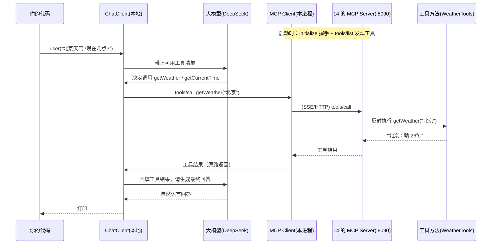

# 19 · MCP 客户端（MCP Client）

> 本模块目标：写一个 **MCP 客户端**，连接到模块 14 的 **MCP 服务器**，把远端暴露的工具
> （`getWeather`、`getCurrentTime`）拉到本地交给大模型使用。它与 14（Server 侧）配成**完整闭环**。

## 一、回顾：MCP 的两个角色

| 角色 | 说明 | 对应模块 |
|---|---|---|
| **MCP Server**（提供方） | 按 MCP 规范把一批工具暴露出去 | **14-mcp** |
| **MCP Client**（消费方） | 连接 Server，发现工具，并在大模型需要时调用 | **★ 本模块 19** |

模块 14 已经把 `getWeather`、`getCurrentTime` 通过 SSE 暴露在 `http://localhost:8090/sse`。
本模块要做的，就是「连上去、拿到工具、交给我们自己的大模型用」。

## 二、整体交互流程（Client ↔ Server 闭环）



调用要点：**握手 → 发现工具 → 模型决定调用 → 跨进程执行 → 结果原路返回 → 模型作答**。

## 三、关键依赖

```xml
<!-- 让本应用成为 MCP 客户端，自动连接远端 Server 并把远程工具包装成 ToolCallbackProvider -->
<dependency>
    <groupId>org.springframework.ai</groupId>
    <artifactId>spring-ai-starter-mcp-client</artifactId>
</dependency>
<!-- 用 DeepSeek 做对话模型来“驱动”工具调用 -->
<dependency>
    <groupId>org.springframework.ai</groupId>
    <artifactId>spring-ai-starter-model-openai</artifactId>
</dependency>
```

## 四、关键配置（`application.yml`）

```yaml
spring:
  ai:
    mcp:
      client:
        type: SYNC
        sse:
          connections:
            weather-server:               # 连接名（随意起）
              url: http://localhost:8090   # 远端 Server 基础地址，客户端自动拼 /sse
```

## 五、关键代码

```java
// ToolCallbackProvider 由 MCP Client Starter 自动装配，内含从远端拉来的工具
public McpClientDemoRunner(ChatClient.Builder builder, ToolCallbackProvider mcpToolProvider) {
    this.chatClient = builder
            .defaultToolCallbacks(mcpToolProvider)  // 把远程工具设为默认工具
            .build();
}

// 模型会自动决定调用 getWeather("北京") 和 getCurrentTime()
String answer = chatClient.prompt()
        .user("北京今天天气怎么样？现在几点？")
        .call()
        .content();
```

## 六、怎么运行（★ 必须两步 ★）

MCP 是 Client/Server 架构，**必须先启动服务器，再启动客户端**：

```bash
# 第 1 步：先启动模块 14 的 MCP Server（保持这个终端不要关）
cd 14-mcp
mvn spring-boot:run
# 等它在 8090 端口就绪（控制台不再滚动）

# 第 2 步：另开一个终端，运行本模块
cd 19-mcp-client
mvn spring-boot:run
```

> 若先启动本模块而 14 尚未就绪，客户端会因连不上 `http://localhost:8090/sse` 而启动失败。
> 本模块的验收只要求 `mvn -q compile` 通过；实际联调需要你先起 14。

## 七、预期输出（示例）

```
========== 模块19：MCP 客户端调用远程工具 ==========

【已从远端 MCP Server 发现并拉取到 2 个工具】
  - getWeather : 查询指定城市的当前天气情况...
  - getCurrentTime : 获取服务器当前的日期和时间...

【我问】北京今天天气怎么样？现在几点？

【AI 答（已综合远程工具结果）】北京今天晴，气温 26℃……当前时间是 2026-06-30 ...

========== 演示结束：本地模型成功调用了远程 MCP 工具！ ==========
```

## 八、小结

- MCP Client = 工具的「消费方」：连上 Server，把远程工具变成本地可用的 `ToolCallbackProvider`。
- `.defaultToolCallbacks(provider)` 一行就把远程工具交给了大模型。
- 14（Server）+ 19（Client）合起来才是 MCP 的完整闭环：工具运行在别处，本应用连上去即可使用。
- 下一站：[20-moderation](../20-moderation) 学习用审核模型检测违规内容。
