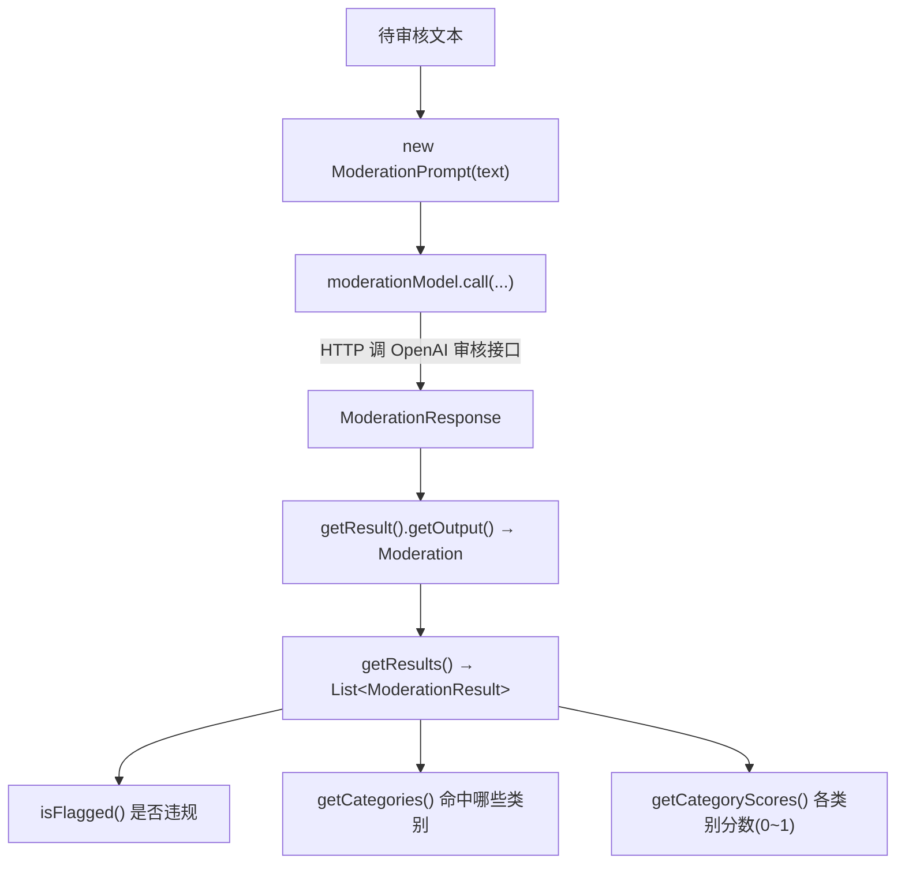

# 20 · 内容审核（Moderation）

> 本模块目标：用 **审核模型** 检测一段文本是否包含违规内容（暴力、仇恨、骚扰、色情、自残等），
> 拿到「是否违规、命中类别、各类别分数」三类信息。

## 一、内容审核是什么 / 用来干嘛

内容审核（Moderation）**不是对话**，而是给模型一段文本，让它输出一份「安全体检报告」。
典型用途：

| 场景 | 说明 |
|---|---|
| **UGC 过滤** | 用户发的评论、弹幕、帖子先过一遍审核，违规的拦下或转人工。 |
| **合规风控** | 在把用户输入喂给大模型前先审核，避免被诱导生成有害内容。 |
| **出站审核** | 也可审核大模型自己生成的回答，做二次兜底。 |

## 二、为什么必须用 OpenAI

> ★ 审核能力**只有 OpenAI 提供，DeepSeek 不支持** ★。

所以本模块走**真正的 OpenAI**：需要 `OPENAI_API_KEY`，base-url 用共享配置里父级的
`https://api.openai.com`。本模块只在本地额外指定一下审核模型名。

> 注意：若你当前 OpenAI 账户**无额度**，实际调用会返回 **HTTP 429**（额度不足）。
> 这不影响代码与配置的正确性——本模块的验收只要求 `mvn -q compile` 通过。

## 三、审核流程图



## 四、响应对象层级（记牢这条链）

```
ModerationResponse
  └─ getResult() : Generation
       └─ getOutput() : Moderation
            └─ getResults() : List<ModerationResult>
                 └─ isFlagged() / getCategories() / getCategoryScores()
```

## 五、关键配置（`application.yml`）

```yaml
spring:
  ai:
    openai:
      moderation:
        options:
          model: omni-moderation-latest   # 或旧版 text-moderation-latest
```

## 六、关键代码

```java
// 注入审核模型（实现是 OpenAiModerationModel，由 starter 自动配置）
public ModerationDemoRunner(ModerationModel moderationModel) { ... }

// 调用审核 + 解读结果
ModerationResponse response = moderationModel.call(new ModerationPrompt(text));
ModerationResult result = response.getResult().getOutput().getResults().get(0);

boolean flagged = result.isFlagged();          // 是否违规
Categories cat = result.getCategories();        // cat.isViolence() / isHate() ...
CategoryScores scores = result.getCategoryScores(); // scores.getViolence() ...（0~1）
```

## 七、怎么运行

```bash
cd 20-moderation
export OPENAI_API_KEY=sk-你的key   # 必须，且账户需有额度
mvn spring-boot:run
```

## 八、预期输出（示例）

```
----- 审核【正常文本】：今天天气真好...
   是否违规(flagged)：false
   关键分数(score)：暴力=0.0001  仇恨=0.0000 ...

----- 审核【违规文本】：I will find you and hurt you...
   是否违规(flagged)：true
   命中类别：
     [命中]   暴力(violence)
   关键分数(score)：暴力=0.9xxx ...
```

## 九、小结

- 审核 = 给文本做“安全体检”，返回 flagged + 命中类别 + 各类别分数。
- 调用三件套：`new ModerationPrompt(文本)` → `moderationModel.call(...)` → 逐层取 `ModerationResult`。
- 只有 OpenAI 支持，需 `OPENAI_API_KEY`（无额度会 429，但代码正确）。
- 这是本学习项目的**最后一站**，恭喜你走完了 Spring AI 的核心能力地图！
