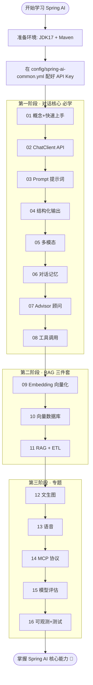
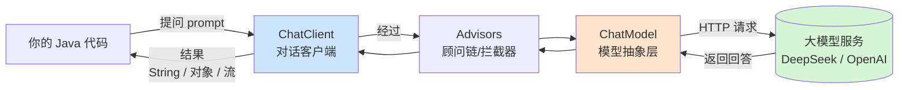

# Spring AI 零基础学习项目 🚀

> 一个面向**零基础小白**的 Spring AI 学习项目。把 [Spring AI 官方文档](https://docs.spring.io/spring-ai/reference/index.html) 的每个核心知识点拆成一个**独立可运行的 Maven 模块**，按 `01 → 16` 的顺序循序渐进。每个模块都有**详细中文注释 + 流程图 + 独立 README**。

---

## 一、这是什么 / 能学到什么

Spring AI 是 Spring 官方推出的 AI 应用开发框架，让 Java 开发者能用熟悉的 Spring 方式（依赖注入、自动配置、Starter）来调用各种大模型（对话、向量、图片、语音等），而不用关心底层 HTTP 细节。

本项目把官方文档左侧菜单的核心知识点，整理成 16 个学习模块：

| 顺序 | 模块文件夹 | 知识点 | 一句话说明 |
|:---:|---|---|---|
| 01 | `01-overview-quickstart` | 概念 + 快速上手 | AI 核心概念，写出第一个 ChatClient 调用 |
| 02 | `02-chat-client` | ChatClient API | 对话客户端：流式/非流式、运行时参数 |
| 03 | `03-prompt` | Prompt 提示词 | 提示词模板、System/User 角色 |
| 04 | `04-structured-output` | 结构化输出 | 把 AI 回答自动转成 Java 对象/List/Map |
| 05 | `05-multimodality` | 多模态 | 图片 + 文字一起喂给模型 |
| 06 | `06-chat-memory` | 对话记忆 | 让 AI 记住上下文，实现多轮对话 |
| 07 | `07-advisors` | Advisor 顾问 | 拦截/增强请求的 AOP 式机制 |
| 08 | `08-tool-calling` | 工具调用 | 让 AI 调用你的 Java 方法（函数调用） |
| 09 | `09-embedding` | 文本向量化 | 把文字变成向量，用于相似度计算 |
| 10 | `10-vector-store` | 向量数据库 | 存取向量，做语义检索（内存版） |
| 11 | `11-rag-etl` | RAG + ETL | 检索增强生成 + 文档处理管道 |
| 12 | `12-image-model` | 文生图 | 用文字生成图片 |
| 13 | `13-audio-model` | 语音 | 语音转文字 + 文字转语音 |
| 14 | `14-mcp` | MCP 协议 | 模型上下文协议，标准化工具/资源接入 |
| 15 | `15-model-evaluation` | 模型评估 | 评估 AI 回答质量（相关性/事实性） |
| 16 | `16-observability-testing` | 可观测 + 测试 | 指标追踪 + 如何给 AI 应用写测试 |

> **建议学习顺序**：严格按 01 → 16。前 8 个是对话核心，必学；09~11 是 RAG 知识库三件套；12~16 是进阶专题。

---

## 二、环境要求

| 工具 | 版本 | 说明 |
|---|---|---|
| JDK | **17+** | Spring Boot 3.5 / Spring AI 1.1 要求 |
| Maven | **3.6+** | 构建工具 |
| Spring Boot | 3.5.4 | 已在父 pom 锁定 |
| Spring AI | 1.1.7 | 当前最新稳定 GA 版（已在父 pom 锁定） |

检查环境：
```bash
java -version   # 应显示 17 或更高
mvn -version
```

---

## 三、★ 只需配置一处：填好 API Key

本项目所有模块共用**同一个配置文件**：[`config/spring-ai-common.yml`](config/spring-ai-common.yml)。
你**只需要在这一个文件里填 Key**，16 个模块全部生效。

**模型策略（DeepSeek 为主 + OpenAI 兼容）：**
- 对话类能力 → 走 **DeepSeek**（便宜、国内可直连，注册送额度：https://platform.deepseek.com/ ）
- 向量 / 图片 / 语音能力 → DeepSeek 不支持，走真正的 **OpenAI**

**填 Key 的两种方式（二选一）：**

```bash
# 方式 A（推荐）：设置环境变量，配置文件一个字都不用改
export DEEPSEEK_API_KEY=sk-你的deepseek密钥
export OPENAI_API_KEY=sk-你的openai密钥
```

或 **方式 B**：直接打开 `config/spring-ai-common.yml`，把里面 `${DEEPSEEK_API_KEY:...}` 冒号后面的默认值换成你的真实 Key。

> 💡 如果你只学对话相关模块（01~08、11、15），**只需要 DeepSeek 的 Key** 就够了。

---

## 四、怎么运行某个模块

每个模块都是一个独立的 Spring Boot 应用，运行时会自动跑 `CommandLineRunner` 里的演示代码并把结果打印到控制台。

**⚠️ 重要：请进入模块文件夹再运行**（这样才能正确找到上一层的共享配置文件）：

```bash
# 例：运行第 2 个模块
cd 02-chat-client
mvn spring-boot:run
```

或在 IDE（IDEA）里：打开对应模块的启动类（`XxxApplication`），右键 Run。
（IDEA 默认工作目录就是模块目录，能正确加载共享配置。）

---

## 五、整体学习流程图



---

## 六、Spring AI 核心调用原理（建议先看懂这张图）



- **ChatModel**：最底层的模型抽象，直接对接某家大模型的 HTTP 接口。
- **ChatClient**：在 ChatModel 之上的高级流式 API（推荐使用），支持链式调用、Advisor、结构化输出等。
- **Advisors**：类似拦截器/AOP，可在请求前后做增强（如自动加入历史记忆、检索资料 RAG 等）。

---

## 七、项目结构

```
spring-ai-learning/
├── pom.xml                       # 父工程（聚合 + 版本管理）
├── README.md                     # 本文件
├── config/
│   └── spring-ai-common.yml      # ★ 全局唯一配置（填 Key 的地方）
├── 01-overview-quickstart/       # 每个模块都是独立 Spring Boot 应用
│   ├── pom.xml
│   ├── README.md                 # 模块独立说明 + 流程图
│   └── src/main/...
├── 02-chat-client/
├── ...
└── 16-observability-testing/
```

---

## 八、常见问题 FAQ

**Q：报错 401 Unauthorized / Incorrect API key？**
A：Key 没填对。检查 `config/spring-ai-common.yml` 或环境变量。对话模块用 DeepSeek 的 Key，向量/图片/语音模块用 OpenAI 的 Key。

**Q：找不到共享配置 / 配置没生效？**
A：请确保是在**模块目录内**运行（`cd 02-chat-client && mvn spring-boot:run`），共享配置用相对路径 `../config/` 定位。

**Q：DeepSeek 报错说不支持 embedding / image？**
A：对的，DeepSeek 只支持对话。向量/图片/语音模块需要 OpenAI 的 Key。

**Q：网络超时？**
A：访问 OpenAI 可能需要代理。DeepSeek 国内可直连。

---

祝学习愉快！每个模块的 `README.md` 都有该知识点的详细讲解和流程图，建议边看 README 边读代码。
